# Responsive_flexbox

# HTML CODE:

```html
<!DOCTYPE html>
<html lang="en">
<head>
    <meta charset="UTF-8">
    <meta name="viewport" content="width=device-width, initial-scale=1.0">
    <title>Elden Ring Guide </title>
    <link rel="stylesheet" href="styles.css">
    <link href="https://fonts.googleapis.com/css2?family=Cinzel:wght@400;700&display=swap" rel="stylesheet">
    <link rel="icon" href="img/logo.png" type="image/png">
</head>
<body>
    <header class="header">
        <div class="hero">
            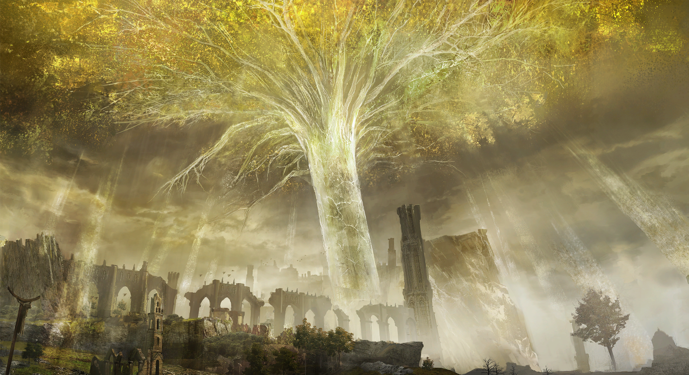
            <div class="hero-text">
                <h1>Elden Ring Guide</h1>
                <p>Your Ultimate Companion to Conquer the Lands Between</p>
            </div>
        </div>
    </header>
    
    <nav class="navbar">
        <ul>
            <li><a href="#home">Home</a></li>
            <li><a href="#tips">Tips</a></li>
            <li><a href="#builds">Builds</a></li>
            <li><a href="#maps">Maps</a></li>
            <li><a href="#bosses">Bosses</a></li>
            <li><a href="#contact">Contact</a></li>
        </ul>
    </nav>
    
    <main class="content">
        <section id="home" class="section">
            <h1>Welcome to Elden Ring</h1>
            
            <h1>The most anticipated game is here! Prepare to enter a world of fantasy, danger, and epic battles.</h1>
        </section>
        <section id="tips" class="section parallax" style="background-image: url('tips-background.jpg');">
            <h2>Top Tips for New Players</h2>
            <div class="tips-container">
                <div class="tip">
                    
                    <h3>Explore Everything</h3>
                    <p>Don't rush the main quest. Exploring the world can lead to valuable items and skills.</p>
                </div>
                <div class="tip">
                    
                    <h3>Master the Combat</h3>
                    <p>Timing is crucial. Learn enemy patterns and use your shield wisely.</p>
                </div>
                <div class="tip">
                    
                    <h3>Use Your Environment</h3>
                    <p>Take advantage of high ground, hiding spots, and environmental traps to defeat enemies.</p>
                </div>
            </div>
        </section>
<section id="builds" class="section parallax" style="background-image: url('builds-background.jpg');">
    <h2>Recommended Builds</h2>
    <div class="builds-container">
        <div class="build">
            
            <h3>Strength Build</h3>
            <p>Focus on heavy weapons and high damage output. Suitable for players who prefer brute force and powerful strikes.</p>
        </div>
        <div class="build">
            
            <h3>Dexterity Build</h3>
            <p>Swift attacks and evasion, perfect for agile players who like to dodge and strike quickly.</p>
        </div>
        <div class="build">
            
            <h3>Magic Build</h3>
            <p>Harness the power of sorcery to defeat foes from a distance. Ideal for players who prefer casting spells.</p>
        </div>
    </div>
</section>
        <section id="maps" class="section">
            <h2>Interactive Maps</h2>
            <div class="maps-container">
                <div class="map">
                    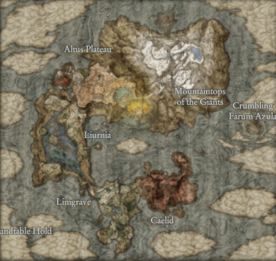
                    <h3>The Lands Between</h3>
                    <p>Explore the primary areas of Elden Ring's world. Find key locations and hidden treasures.</p>
                </div>
                <div class="map">
                    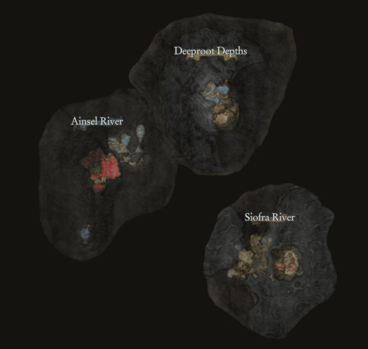
                    <h3>Underground Map</h3>
                    <p>It is the under map for the land between.</p>
                </div>
                <div class="map">
                    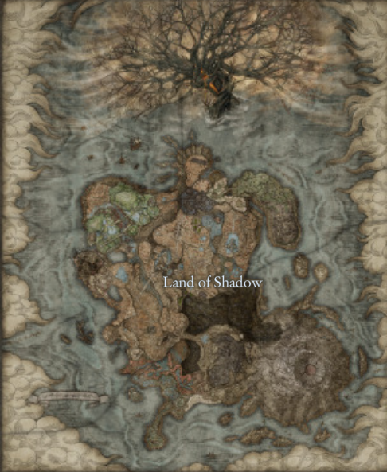
                    <h3>Land of Shadow</h3>
                    <p>This is the map for the DLC get ready to die a lot.</p>
                </div>
            </div>
        </section>

        <section id="bosses" class="section parallax" style="background-image: url('bosses-background.jpg');">
            <h2>Epic Boss Fights</h2>
            <p>Face the mighty bosses that rule the Lands Between. Here are some tips to help you:</p>
            <div class="boss-tips">
                <div class="boss">
                    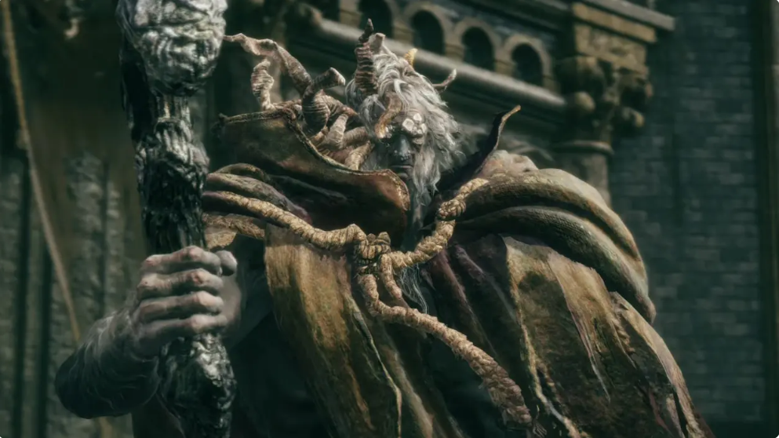
                    <h3>Margit, The Fell Omen</h3>
                    <p>A formidable foe with quick attacks. Dodge his strikes and look for openings.</p>
                </div>
                <div class="boss">
                    
                    <h3>Godrick the Grafted</h3>
                    <p>Watch out for his area attacks. Use the environment to your advantage.</p>
                </div>
                <div class="boss">
                    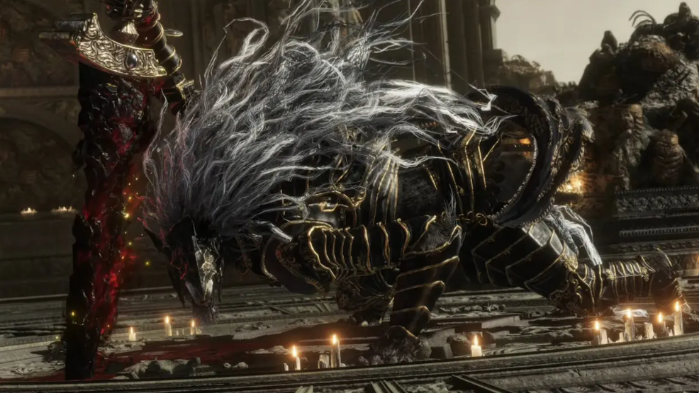
                    <h3>Maliketh, the Black Blade</h3>
                    <p>His attacks are swift and deadly. Patience and timing are key.</p>
                </div>
                <div class="boss">
                    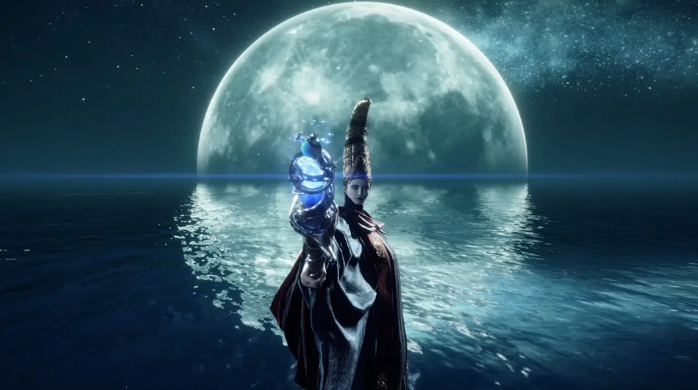
                    <h3>Rennala, Queen of the Full Moon</h3>
                    <p>Watch out for the crippled girls and juct cut her up.</p>
                </div>
                <div class="boss">
                    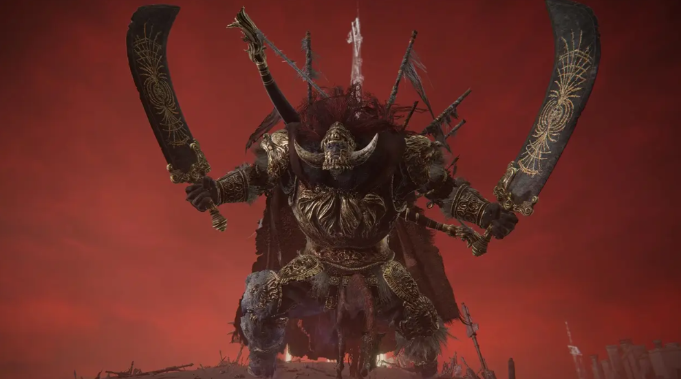
                    <h3>Starscourge Radahn</h3>
                    <p>You wiil die, dont give up and use four summons for assist.</p>
                </div>
                <div class="boss">
                    
                    <h3>Godfrey, First Elden Lord (Golden Shade)</h3>
                    <p>Not so tough but watch out for his stomps and shout.</p>
                </div>
                <div class="boss">
                    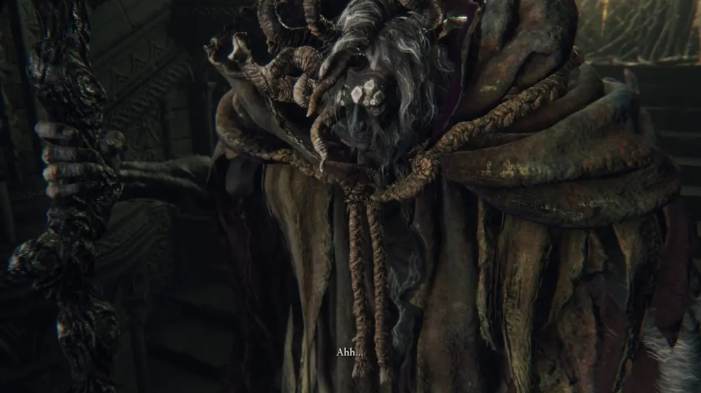
                    <h3>Morgott, The Omen King</h3>
                    <p>Just dance around like it is a ballet and kick his ass.</p>
                </div>
                <div class="boss">
                    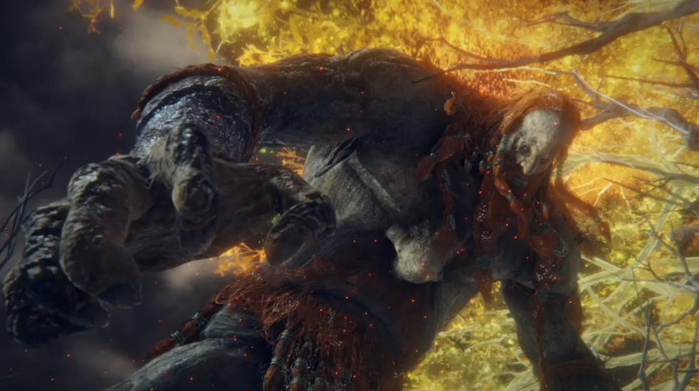
                    <h3>Fire Giant</h3>
                    <p>Summon Alexander for help, and you can use Torrent too easy kill.</p>
                </div>
                <div class="boss">
                    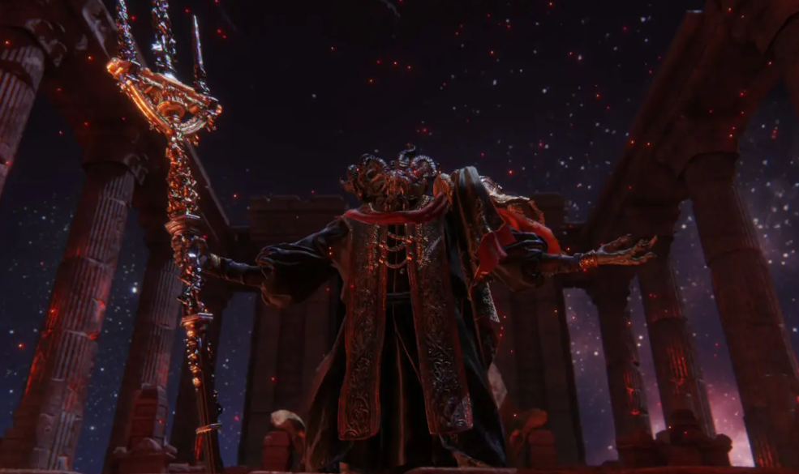
                    <h3>Mohg, Lord of Bloo</h3>
                    <p>His paint brush can be annoying but you can kill him with range attacks.</p>
                </div>
                <div class="boss">
                    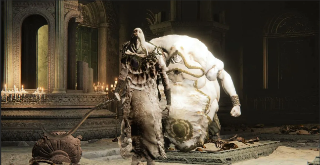
                    <h3>Godskin Duo</h3>
                    <p>You can put them to sleep using St.Trina arrows and it is on.</p>
                </div>
                <div class="boss">
                    
                    <h3>Sir Gideon Ofnir, the All-Knowing</h3>
                    <p>Don't give him a chance to talk and use continous attacks to kill him.</p>
                </div>
                <div class="boss">
                    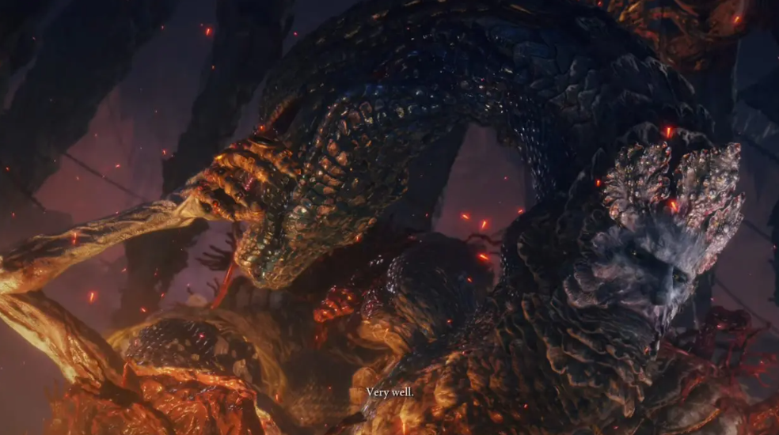
                    <h3>Rykard, Lord of Blasphemy</h3>
                    <p>Just pick up the spar near the boss and cheese him with it.</p>
                </div>
                <div class="boss">
                    
                    <h3>Godfrey, First Elden Lord</h3>
                    <p>You cannot cheese him, read his patterns to kill him.</p>
                </div>
                <div class="boss">
                    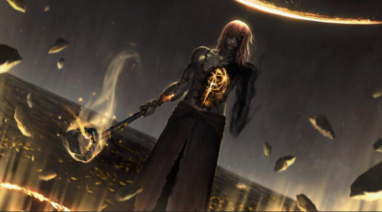
                    <h3>Radagon</h3>
                    <p>It will be epic with the BGM but don't be distracted it's not over yet.</p>
                </div>
                <div class="boss">
                    
                    <h3>Elden Beast</h3>
                    <p>It won't be a problem with your trusty torrent and mimic tear.</p>
                </div>
                <div class="boss">
                    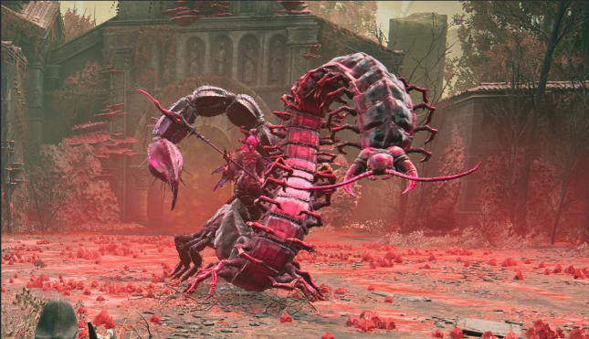
                    <h3>Romina Saint of the Bud</h3>
                    <p>She will not target your mimic tear and kill you first so it's hell.</p>
                </div>
                <div class="boss">
                    
                    <h3>Messmer the Impaler</h3>
                    <p>It will be a tough battle, but it will be awesome so spam it.</p>
                </div>
                <div class="boss">
                    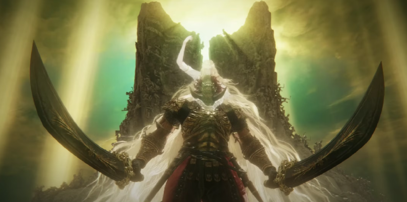
                    <h3>Promised Consort Radahn</h3>
                    <p>You will die again and again and again but dont ever give up it will be legendary.</p>
                </div>
            </div>
        </section>
    </main>
    <section id="contact" class="contact-section">
        <h2>Contact Us</h2>
        <p>Have a question or want to connect? Reach out through the form below.</p>
        
        <div class="contact-container">
            <div class="contact-form">
                <form action="#" method="post">
                    <div class="form-group">
                        <label for="name">Name:</label>
                        <input type="text" id="name" name="name" placeholder="Enter your name" required>
                    </div>
                    <div class="form-group">
                        <label for="email">Email:</label>
                        <input type="email" id="email" name="email" placeholder="Enter your email" required>
                    </div>
                    <div class="form-group">
                        <label for="message">Message:</label>
                        <textarea id="message" name="message" rows="5" placeholder="Type your message" required></textarea>
                    </div>
                    <button type="submit">Send Message</button>
                </form>
            </div>
        </div>
    </section>
    <footer class="footer">
        <p>&copy; 2024 Elden Ring Guide. All rights reserved.</p>
        <p>Contact us at: <a href="https://melvin14112004.github.io/Responsive_flexbox/">Elden Ring Guide</a></p>
    </footer>  
</body>
</html>
```

# CSS CODE:

```css
body, h1, h2, h3, p {
    margin: 0;
    padding: 0;
    font-family: 'Arial', sans-serif;
    color: #f0e68c;
}

body {
    background-color: #1a1a1a;
    line-height: 1.6;
}

.navbar {
    background-color: #222;
    color: #d4d4d4;
    padding: 15px;
    text-align: center;
    border-bottom: 2px solid #444;
    position: sticky;
    top: 0;
    z-index: 1000;
}

.navbar ul {
    list-style-type: none;
    display: flex;
    justify-content: center;
}

.navbar li {
    margin: 0 20px;
}

.navbar a {
    color: #f0e68c;
    text-decoration: none;
    transition: color 0.3s;
}

.navbar a:hover {
    color: #fff;
}

.hero {
    background-image: url('huge-fluid-image.jpg');
    background-size: cover;
    background-position: center;
    height: 80vh;
    display: flex;
    align-items: center;
    justify-content: center;
    color: #fff;
    text-shadow: 2px 2px 4px #000;
}

.hero-image {
    width: 100%;
    height: auto; 
    display: block; 
    max-height: 100vh;
    object-fit: cover; 
}

.fluid-image {
    width: 100%;              
    height: auto;           
    max-height: 80vh;          
    object-fit: cover;        
    object-position: center;    
    display: block;             
}

.hero {
    position: relative;     
    overflow: hidden;          
}

.hero-text {
    position: absolute;       
    top: 50%;               
    left: 50%;                 
    transform: translate(-50%, -50%);
    color: white;              
    text-align: center;        
    background-color: rgba(0, 0, 0, 0.5); 
    padding: 10px 20px;        
    border-radius: 8px;        
}
.hero h1 {
    font-size: 3em;
}

.section {
    padding: 60px 20px;
    text-align: center;
}

.parallax {
    background-attachment: fixed;
    background-size: cover;
    background-position: center;
    color: #fff;
}


.tips-container {
    display: flex;
    justify-content: space-around;
    flex-wrap: wrap;
    margin-top: 20px;
}

.tip {
    width: 30%;
    margin: 10px;
    background-color: #333;
    padding: 20px;
    border-radius: 8px;
    text-align: center;
    box-shadow: 0 0 10px rgba(0, 0, 0, 0.5);
    transition: transform 0.3s, box-shadow 0.3s;
    overflow: hidden; 
}

.tip img {
    width: 100%;
    height: auto;
    border-radius: 8px;
    margin-bottom: 15px;
    box-shadow: 0 0 5px rgba(0, 0, 0, 0.3);
}

.tip h3 {
    color: #f0e68c;
    margin-bottom: 10px;
}

.tip:hover {
    transform: scale(1.05);
    box-shadow: 0 0 15px rgba(255, 255, 255, 0.5);
}

.builds-container {
    display: flex;
    justify-content: space-around;
    flex-wrap: wrap;
    margin-top: 20px;
}

.build {
    width: 30%;
    margin: 10px;
    background-color: #333;
    padding: 20px;
    border-radius: 8px;
    text-align: center;
    box-shadow: 0 0 10px rgba(0, 0, 0, 0.5);
    transition: transform 0.3s, box-shadow 0.3s;
    overflow: hidden; /* Prevent content overflow */
}

.build img {
    width: 100%;
    height: auto;
    border-radius: 8px;
    margin-bottom: 15px;
    box-shadow: 0 0 5px rgba(0, 0, 0, 0.3);
}

.build h3 {
    color: #f0e68c;
    margin-bottom: 10px;
}

.build:hover {
    transform: scale(1.05);
    box-shadow: 0 0 15px rgba(255, 255, 255, 0.5);
}
.maps-container {
    display: flex;
    justify-content: space-around;
    flex-wrap: wrap;
    margin-top: 20px;
}

.map {
    width: 30%;
    margin: 10px;
    background-color: #333;
    padding: 20px;
    border-radius: 8px;
    text-align: center;
    box-shadow: 0 0 10px rgba(0, 0, 0, 0.5);
    transition: transform 0.3s, box-shadow 0.3s;
    overflow: hidden;
}

.map img {
    width: 100%;
    height: auto;
    border-radius: 8px;
    margin-bottom: 15px;
    box-shadow: 0 0 5px rgba(0, 0, 0, 0.3);
}

.map h3 {
    color: #f0e68c;
    margin-bottom: 10px;
}

.map:hover {
    transform: scale(1.05);
    box-shadow: 0 0 15px rgba(255, 255, 255, 0.5);
}

.boss-tips {
    display: flex;
    justify-content: space-around;
    flex-wrap: wrap;
    margin-top: 20px;
}

.boss {
    width: 30%;
    margin: 10px;
    background-color: #333;
    padding: 20px;
    border-radius: 8px;
    text-align: center;
    box-shadow: 0 0 10px rgba(0, 0, 0, 0.5);
    transition: transform 0.3s, box-shadow 0.3s;
    overflow: hidden;
}

.boss img {
    width: 100%;
    height: auto;
    border-radius: 8px;
    margin-bottom: 15px;
    box-shadow: 0 0 5px rgba(0, 0, 0, 0.3);
}

.boss h3 {
    color: #f0e68c;
    margin-bottom: 10px;
}

.boss:hover {
    transform: scale(1.05);
    box-shadow: 0 0 15px rgba(255, 255, 255, 0.5);
}


.footer {
    background-color: #333;
    color: #d4d4d4;
    text-align: center;
    padding: 20px 0;
    border-top: 2px solid #444;
}

.footer a {
    color: #b3b3b3;
    text-decoration: none;
    transition: color 0.3s;
}

.footer a:hover {
    color: #d4d4d4;
}

.contact-section {
    background-color: #1c1c1e; 
    color: #ffffff;
    padding: 50px 20px;
    text-align: center;
}

.contact-section h2 {
    font-size: 2em;
    margin-bottom: 20px;
    color: #ffdd57;
}

.contact-section p {
    font-size: 1.2em;
    margin-bottom: 40px;
    color: #c4c4c4; 
}

.contact-container {
    max-width: 600px;
    margin: 0 auto;
}

.contact-form {
    background-color: #2c2c2e; 
    padding: 20px; 
    border-radius: 10px;
    box-shadow: 0 4px 8px rgba(0, 0, 0, 0.2);
}

.contact-form .form-group {
    margin-bottom: 15px;
    text-align: left;
}

.contact-form label {
    display: block;
    font-weight: bold;
    margin-bottom: 8px;
    color: #ffdd57; 
}

.contact-form input,
.contact-form textarea {
    width: 95%;
    padding: 8px; 
    border: none;
    border-radius: 5px;
    background-color: #1c1c1e;
    color: #ffffff;
}

.contact-form button {
    background-color: #ffdd57;
    color: #1c1c1e;
    padding: 8px 16px; 
    border: none;
    border-radius: 5px;
    cursor: pointer;
    transition: background-color 0.3s ease;
}

.contact-form button:hover {
    background-color: #ffc107; 
}


@media (max-width: 768px) {
    .navbar ul {
        flex-direction: column;
        align-items: center;
    }

    .tips-container, .builds-container, .maps-container, .boss-tips {
        flex-direction: column;
        align-items: center;
    }

    .tip, .build, .map, .boss {
        width: 80%;
        margin-bottom: 20px;
    }

    .hero {
        height: 60vh;
    }
}